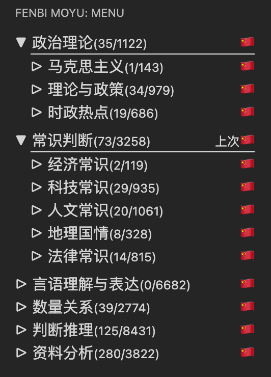
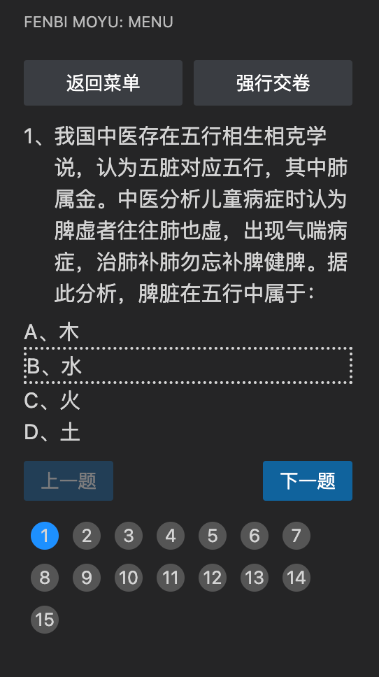

# fenbimoyu
### 粉笔考公刷题插件，马上35了怎么办？？？
版权声明：代码基于"https://github.com/maoguy/fenbi-client.git"
这个兄弟的代码进行修改，因为找了两个都不能每一页刷一个题目，题目全部在一页有点混乱，所以在此基础上进行了修改

如果有问题，在这个连接进行提问：https://github.com/Jolly-Xu/fenbimoyu

粉笔考公刷题插件，每个题目单独展示，登陆粉笔官网，然后打开控制台，查看请求，点击题目或者刷题。然后在请求中就会出现对应的cookie，复制cookie到设置里面即可。应该程序员都会吧！！！

